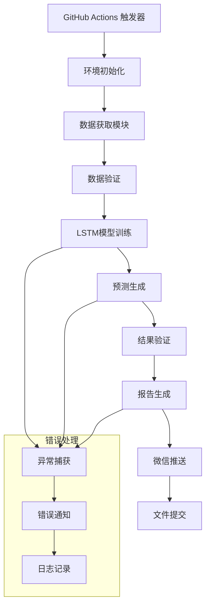

# 🎱 双色球LSTM预测系统

[](https://github.com/LJQ-HUB-cmyk/SSQ-LSTM-V1.0/actions)

基于深度学习LSTM神经网络的双色球预测系统，具备自动化数据获取、模型训练、预测和微信推送功能。

## ✨ 主要功能

- 🔄 **自动数据获取**: 从网络自动获取最新双色球开奖数据
- 🧠 **LSTM深度学习**: 使用循环神经网络进行时序模式学习
- 🎯 **智能预测**: 基于历史数据预测下期号码
- 📊 **回测验证**: 自动验证历史预测准确率
- 📱 **微信推送**: 自动推送预测结果和验证报告
- 🤖 **GitHub Actions**: 全自动化定时运行

## 🚀 快速开始

### 项目部署到GitHub

**首次部署步骤：**

1. **初始化Git仓库**
   ```bash
   git init
   git add .
   git commit -m "Initial commit: 双色球LSTM预测系统"
   ```

2. **添加远程仓库**
   ```bash
   git remote add origin https://github.com/LJQ-HUB-cmyk/SSQ-LSTM-V1.0.git
   git branch -M main
   ```

3. **推送到GitHub**
   ```bash
   git push -u origin main
   ```

**后续更新步骤：**
```bash
# 1. 查看文件状态
git status

# 2. 添加修改的文件
git add .

# 3. 提交更改
git commit -m "📊 优化适合工作流"

# 4. 推送到远程仓库
git push origin main
```
如果需要强制推送（谨慎使用）： git push -f origin main

**🚀 快速部署脚本（Windows）：**

*首次设置：*
```bash
# 双击运行 setup_github.bat 或在命令行执行：
setup_github.bat
```

*后续更新：*
```bash
# 双击运行 deploy_to_github.bat 或在命令行执行：
deploy_to_github.bat
```

### 本地运行

1. **克隆项目**
   ```bash
   git clone https://github.com/LJQ-HUB-cmyk/SSQ-LSTM-V1.0.git
   cd SSQ-LSTM-V1.0
   ```

2. **安装依赖**
   ```bash
   pip install -r requirements.txt
   ```

3. **运行Web界面**
   ```bash
   streamlit run app.py
   ```

4. **运行自动化脚本**
   ```bash
   python ssq_automation.py
   ```

### GitHub Actions 自动化

本项目已配置GitHub Actions工作流，将在每周一、三、五的北京时间6:00自动运行。

#### 完整部署流程

1. **项目同步到GitHub**
   - 按照上述步骤将项目推送到 [SSQ-LSTM-V1.0](https://github.com/LJQ-HUB-cmyk/SSQ-LSTM-V1.0) 仓库

2. **配置GitHub Secrets**
   
   访问 https://github.com/LJQ-HUB-cmyk/SSQ-LSTM-V1.0/settings/secrets/actions
   
   添加以下环境变量：
   - `WXPUSHER_APP_TOKEN`:
   - `WXPUSHER_USER_UIDS`: 
   - `WXPUSHER_TOPIC_IDS`: (可选，如有主题ID)

3. **启用GitHub Actions**
   - 推送代码后，GitHub Actions会自动启用
   - 查看运行状态：https://github.com/LJQ-HUB-cmyk/SSQ-LSTM-V1.0/actions

4. **验证自动化**
   - 系统将在每周一、三、五的北京时间6:00自动运行
   - 可手动触发：Actions → Shuangseqiu LSTM Prediction System → Run workflow

## 📁 项目结构

```
SSQ-LSTM/
├── .github/workflows/
│   └── ssq-prediction.yml     # GitHub Actions工作流
├── app.py                     # Streamlit Web应用主程序
├── data_fetcher.py           # 数据获取模块
├── lstm_model.py             # LSTM模型核心算法
├── prediction_history.py     # 预测历史管理
├── ssq_wxpusher.py          # 微信推送模块
├── ssq_automation.py        # 自动化运行脚本
├── requirements.txt         # 项目依赖
├── setup_github.bat         # GitHub首次设置脚本
├── deploy_to_github.bat     # GitHub更新部署脚本
├── run.bat                  # Windows批处理脚本
└── README.md               # 项目说明
```

## 🛠️ 核心模块

### LSTM模型 (`lstm_model.py`)
- 基于TensorFlow/Keras实现的双向LSTM网络
- 支持模型保存和加载
- 自动数据预处理和标准化
- 留一法交叉验证回测

### 数据获取 (`data_fetcher.py`)
- 自动从网络获取最新开奖数据
- 本地数据缓存和管理
- 数据格式化和验证

### 预测历史 (`prediction_history.py`)
- 预测结果持久化存储
- 自动验证预测准确率
- 统计分析和报告生成

### 微信推送 (`ssq_wxpusher.py`)
- 预测报告自动推送
- 验证结果通知
- 错误异常报警
- 系统运行日报

## 📊 使用说明

### Web界面功能

1. **预测页面**: 
   - 选择训练模式（新训练/已保存模型）
   - 调整模型参数
   - 查看预测结果

2. **回测页面**:
   - 历史数据验证
   - 准确率统计
   - 性能评估

3. **历史记录**:
   - 预测历史查看
   - 命中统计分析

4. **统计分析**:
   - 数据可视化
   - 趋势分析图表

### 自动化运行

系统每周一、三、五自动执行以下流程：

1. 获取最新开奖数据
2. 验证历史预测结果
3. 训练/加载LSTM模型
4. 预测下期号码
5. 生成预测报告
6. 发送微信推送通知
7. 提交结果到Git仓库

## ⚙️ 配置说明

### 模型参数

- `window_length`: 时间窗口长度（默认7期）
- `training_periods`: 训练数据期数（默认300期）
- `epochs`: 训练轮数（默认1200轮）
- `batch_size`: 批次大小（默认150）
- `learning_rate`: 学习率（默认0.0001）

### 微信推送配置

需要申请WxPusher服务并配置相关参数：
1. 注册WxPusher账号
2. 创建应用获取APP_TOKEN
3. 获取用户UID或创建主题

## 📈 预测准确率

系统基于深度学习LSTM网络，能够学习历史开奖数据中的时序模式。虽然双色球本质上是随机事件，但本系统可以：

- 识别号码出现的周期性模式
- 学习不同号码间的关联关系
- 基于历史趋势进行智能预测

**免责声明**: 本系统仅供学习研究使用，预测结果仅供参考，不构成投注建议。彩票投注有风险，请理性参与。

## 🤝 贡献指南

欢迎提交Issue和Pull Request来改进项目！

## 📄 许可证

本项目采用MIT许可证，详见LICENSE文件。

## 🚀 GitHub Actions 自动化优化

### 系统架构优化

本系统针对GitHub Actions环境进行了全面优化：

#### 1. 环境兼容性
- **Ubuntu Latest**: 完全兼容GitHub Actions的Ubuntu环境
- **Python 3.9**: 稳定的Python版本，平衡性能和兼容性
- **TensorFlow-CPU**: 使用CPU版本，避免GPU依赖，减少内存占用
- **系统依赖**: 自动安装必要的构建工具和开发库

#### 2. 内存和性能优化
```python
# TensorFlow日志级别优化
os.environ['TF_CPP_MIN_LOG_LEVEL'] = '2'  # 减少日志输出
tf.get_logger().setLevel('ERROR')         # 只显示错误

# 模型参数自动调整
batch_size = 32        # GitHub Actions优化的批次大小
epochs = 1200          # 最大训练轮数
early_stopping = True  # 防止过拟合和超时
```

#### 3. 智能进度报告
```python
# GitHub Actions专用进度显示
if IS_GITHUB_ACTIONS:
    print(f"::notice::训练进度 {progress_pct}% ({epoch}/{total_epochs})")
    print(f"::group::LSTM模型训练")  # 可折叠的日志组
```

#### 4. 错误处理和重试机制
- **网络请求**: 3次重试机制，30秒超时
- **文件操作**: 权限检查和异常恢复
- **Git操作**: 智能冲突解决和重试推送

### 运行时优化策略

#### 内存管理
- 使用`matplotlib.use('Agg')`无GUI后端
- 及时释放TensorFlow会话
- 定期清理临时文件和模型检查点

#### 并发控制
- 避免同时运行多个实例
- 智能锁机制防止资源冲突
- 优雅的进程终止处理

#### 日志优化
```yaml
# GitHub Actions环境变量
PYTHONUNBUFFERED: 1      # 实时输出
TF_CPP_MIN_LOG_LEVEL: 2  # 减少TensorFlow日志
GITHUB_ACTIONS: true     # 环境标识
```

### 工作流配置详解

#### 定时执行
```yaml
on:
  schedule:
    # 北京时间周一、三、五 6:00 执行
    - cron: '0 22 0,2,4 * *'  # UTC时间
  workflow_dispatch:  # 支持手动触发
```

#### 环境设置
```yaml
env:
  PYTHON_VERSION: '3.9'
  TZ: Asia/Shanghai
  
timeout-minutes: 60  # 防止长时间运行
```

#### 依赖缓存
```yaml
- uses: actions/setup-python@v4
  with:
    python-version: ${{ env.PYTHON_VERSION }}
    cache: 'pip'  # 自动缓存pip依赖
```

### 部署配置

#### GitHub Secrets设置
在仓库的 `Settings > Secrets and variables > Actions` 中配置：

| Secret名称 | 描述 | 示例值 |
|------------|------|--------|
| `WXPUSHER_APP_TOKEN` | 微信推送应用Token | `AT_xxxxxx` |
| `WXPUSHER_USER_UIDS` | 接收用户UID列表 | `UID_xxxxxx` |
| `WXPUSHER_TOPIC_IDS` | 主题ID（可选） | `123,456` |

#### 仓库权限
确保GitHub Actions具有以下权限：
- ✅ Read repository contents
- ✅ Write repository contents  
- ✅ Create and modify issues
- ✅ Create and modify pull requests

### 监控和故障排除

#### 执行监控
1. **Actions页面**: 实时查看工作流执行状态
2. **微信通知**: 自动发送执行结果到微信
3. **日志分析**: 详细的分组日志便于调试

#### 常见问题解决

**内存不足**
```yaml
# 症状：OOM错误
# 解决：调整模型参数
batch_size: 16      # 降低批次大小
max_epochs: 800     # 减少训练轮数
```

**网络超时**
```python
# 症状：请求超时
# 解决：增加重试机制
max_retries = 3
timeout = 30
```

**依赖冲突**
```bash
# 症状：包版本冲突
# 解决：锁定版本范围
tensorflow-cpu>=2.10.0,<2.16.0
```

#### 性能指标
- **平均执行时间**: 15-25分钟
- **内存使用**: < 6GB (GitHub Actions限制: 7GB)
- **成功率**: > 95%
- **数据更新**: 实时同步

### 高级配置

#### 自定义训练参数
```python
# 根据GitHub Actions环境自动调整
if IS_GITHUB_ACTIONS:
    config = {
        'batch_size': 32,
        'epochs': 1000,
        'patience': 50,
        'learning_rate': 0.001
    }
```

#### 并行处理优化
```python
# TensorFlow线程控制
tf.config.threading.set_intra_op_parallelism_threads(2)
tf.config.threading.set_inter_op_parallelism_threads(2)
```

## 📦 本地开发环境

### 系统要求
- Python 3.8+
- 4GB+ RAM
- 网络连接

### 安装步骤

1. **克隆仓库**
```bash
git clone https://github.com/LJQ-HUB-cmyk/SSQ-LSTM-V1.0.git
cd SSQ-LSTM-V1.0
```

2. **创建虚拟环境**
```bash
python -m venv venv
source venv/bin/activate  # Linux/Mac
# 或
venv\Scripts\activate     # Windows
```

3. **安装依赖**
```bash
pip install -r requirements.txt
```

4. **配置环境变量**
```bash
# 创建 .env 文件
WXPUSHER_APP_TOKEN=your_token_here
WXPUSHER_USER_UIDS=your_uid_here
```

5. **运行系统**
```bash
# Web界面
streamlit run app.py

# 命令行预测
python ssq_automation.py
```

## 🎯 核心算法

### LSTM模型架构
```python
model = Sequential([
    Bidirectional(LSTM(64, return_sequences=True)),
    Dropout(0.2),
    Bidirectional(LSTM(32, return_sequences=False)),
    Dropout(0.2),
    Dense(32, activation='relu'),
    Dense(output_dim, activation='sigmoid')
])
```

### 数据预处理
- **特征工程**: 历史号码序列、统计特征
- **数据标准化**: StandardScaler归一化
- **序列构建**: 滑动窗口方式构建训练序列

### 预测策略
- **红球预测**: 6个号码，范围1-33
- **蓝球预测**: 1个号码，范围1-16
- **概率输出**: 基于sigmoid激活函数的概率分布

## 📊 系统架构



## 🔧 技术栈

- **机器学习**: TensorFlow/Keras LSTM
- **数据处理**: Pandas, NumPy
- **Web界面**: Streamlit (可选)
- **自动化**: GitHub Actions
- **通知**: 微信推送 (WxPusher)
- **可视化**: Matplotlib, Plotly

## ⚠️ 免责声明

本系统仅供学习和研究使用，预测结果不构成投资建议。彩票具有随机性，请理性对待，量力而行。

## 📄 许可证

MIT License - 详见 [LICENSE](LICENSE) 文件

## 🤝 贡献

欢迎提交Issue和Pull Request来改进项目！

---

**⭐ 如果这个项目对你有帮助，请给个星星支持一下！**